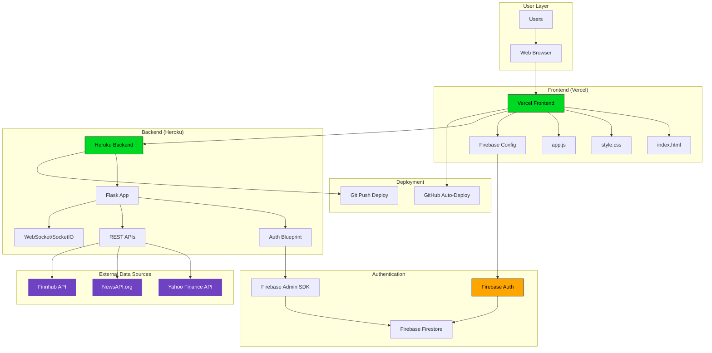
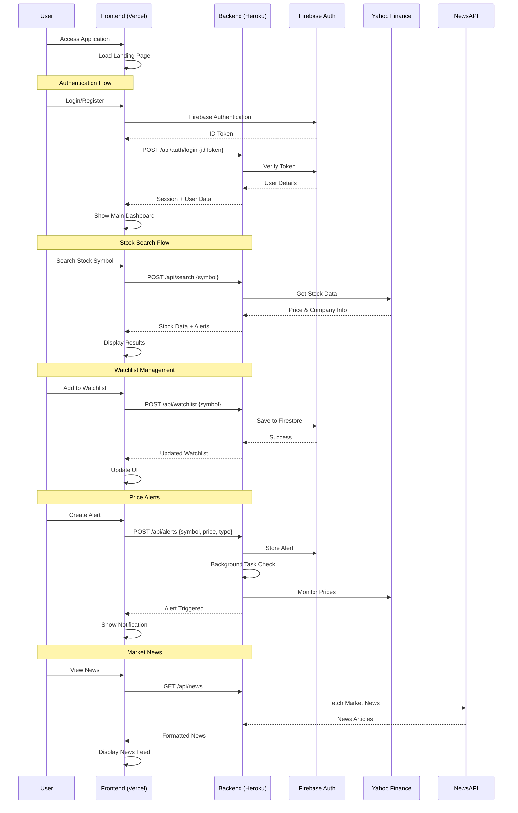

# 📊 Stock Watchlist Pro - Complete System Analysis

## 🎯 Executive Summary

**Stock Watchlist Pro** is a real-time stock tracking application with a modern **hybrid architecture**: a vanilla JavaScript frontend on Vercel and a Flask backend on Heroku. The system processes financial data, manages user watchlists, and delivers price alerts through multiple external APIs.

---

## 🏗️ System Architecture Overview



---

## 📱 Application Flow Diagram



---

## 🛠️ Tech Stack Analysis

### Frontend Stack
| Technology | Version | Status | Purpose |
|------------|---------|--------|---------|
| **HTML5** | Latest | ✅ Modern | Structure & Semantic Markup |
| **CSS3** | Latest | ✅ Modern | Styling with Grid/Flexbox |
| **Vanilla JavaScript** | ES2020+ | ✅ Modern | Core Application Logic |
| **Firebase SDK** | v8.10.1 | ⚠️ Outdated | Client Authentication |
| **Chart.js** | Latest | ✅ Modern | Stock Charts & Visualizations |
| **Font Awesome** | v6.0.0 | ✅ Modern | Icons & UI Elements |
| **Google Fonts (Inter)** | Latest | ✅ Modern | Typography |

### Backend Stack
| Technology | Version | Status | Purpose |
|------------|---------|--------|---------|
| **Python** | 3.11.0 | ✅ Modern | Runtime Environment |
| **Flask** | 2.3.3 | ✅ Modern | Web Framework |
| **Flask-Login** | 0.6.3 | ✅ Modern | Session Management |
| **Flask-SocketIO** | 5.3.6 | ✅ Modern | Real-time Communication |
| **Flask-CORS** | 6.0.1 | ✅ Modern | Cross-Origin Support |
| **Firebase Admin** | 6.2.0 | ✅ Modern | Server-side Authentication |
| **yfinance** | 0.2.36+ | ✅ Modern | Yahoo Finance Data |
| **requests** | 2.31.0 | ✅ Modern | HTTP Client |
| **gunicorn** | 20.1.0+ | ✅ Modern | WSGI Server |
| **eventlet** | 0.33.3+ | ✅ Modern | Async Support |

### Data & Storage
| Technology | Purpose | Status |
|------------|---------|--------|
| **Firebase Firestore** | User Data & Watchlists | ✅ Modern |
| **Firebase Authentication** | User Management | ✅ Modern |
| **Session Storage** | Temporary Client Data | ✅ Standard |

### External APIs
| Service | Purpose | Status | Rate Limits |
|---------|---------|--------|-------------|
| **Yahoo Finance (yfinance)** | Stock Prices & Data | ✅ Active | Unlimited |
| **NewsAPI.org** | Market & Company News | ✅ Active | 1000 req/day |
| **Finnhub** | Company Profiles | ✅ Active | 60 req/min |

### Deployment Infrastructure
| Component | Platform | Status | Auto-Deploy |
|-----------|----------|--------|-------------|
| **Frontend** | Vercel | ✅ Production | ✅ GitHub |
| **Backend** | Heroku | ✅ Production | ✅ Git Push |
| **Domain** | Custom + Vercel | ✅ Active | N/A |
| **SSL/TLS** | Auto (Both) | ✅ Enabled | N/A |

---

## 🚨 Obsolete & Deprecated Components

### 🔴 Critical Issues
1. **Firebase SDK v8 (Frontend)**
   - **Status**: Deprecated (Legacy)
   - **Risk**: Security vulnerabilities, feature limitations
   - **Recommendation**: Upgrade to Firebase v9 (Modular SDK)
   - **Effort**: Medium (requires syntax changes)


### ⚠️ Technical Debt
1. **Vanilla JavaScript Frontend**
   - **Status**: Functional but limiting
   - **Issues**: 
     - No component architecture
     - Difficult state management
     - Manual DOM manipulation
     - No bundling/optimization
   - **Recommendation**: Migrate to React/Next.js (as planned in enterprise-plan.md)

2. **Session-based Authentication**
   - **Status**: Works but not ideal for modern SPAs
   - **Issues**: 
     - CORS complexity
     - Mobile app limitations
     - Scaling challenges
   - **Recommendation**: Move to JWT tokens

3. **Hardcoded API Keys**
   - **Status**: Security risk
   - **Location**: `stock.py` line 9 (NewsAPI key)
   - **Recommendation**: Move to environment variables

4. **No Rate Limiting**
   - **Status**: Production vulnerability
   - **Risk**: API abuse, cost overruns
   - **Recommendation**: Implement Flask-Limiter

### 📋 Missing Production Features
1. **Error Monitoring** (No Sentry/Rollbar)
2. **Application Metrics** (No monitoring dashboard)
3. **Automated Testing** (No unit/integration tests)
4. **CI/CD Pipeline** (Basic git-push deployment only)
5. **Database Backups** (Firestore has built-in backups)
6. **Load Balancing** (Single Heroku dyno)

---

## 🔄 Data Flow Analysis

### User Authentication Flow
```
1. User visits landing page (index.html)
2. User clicks "Sign In" or "Get Started"
3. Firebase Auth SDK handles authentication
4. Frontend receives ID token
5. Frontend sends token to backend (/api/auth/login)
6. Backend verifies token with Firebase Admin SDK
7. Backend creates Flask session
8. User gains access to main dashboard
```

### Stock Data Flow
```
1. User searches for stock symbol
2. Frontend sends request to /api/search
3. Backend fetches data from Yahoo Finance API
4. Backend checks for triggered price alerts
5. Backend returns stock data + alert status
6. Frontend displays results and updates UI
7. If watchlist action: data saved to Firestore
```

### Real-time Updates Flow
```
1. Backend runs periodic tasks (tasks.py)
2. Background jobs check price alerts every 5 minutes
3. When alert triggers: stored in Firestore
4. Frontend polls for alert updates
5. Notifications displayed to user
6. WebSocket connection ready for future real-time features
```

---

## 📊 Performance & Scalability Analysis

### Current Performance
- **Frontend**: Static files on Vercel CDN (excellent performance)
- **Backend**: Single Heroku dyno (limited to ~100 concurrent users)
- **Database**: Firestore (auto-scaling, no concerns)
- **APIs**: Direct calls (no caching, rate limiting)

### Bottlenecks
1. **Single Backend Instance**: No horizontal scaling
2. **Synchronous API Calls**: Blocking operations
3. **No Caching Layer**: Repeated API calls
4. **No Background Processing**: Tasks run in main thread

### Scalability Limits
- **Current**: ~100 concurrent users
- **With optimizations**: ~500 concurrent users
- **Enterprise architecture**: 10,000+ users

---

## 🎯 Modernization Roadmap

### Phase 1: Quick Wins (1-2 weeks)
1. ✅ **Upgrade Firebase SDK to v9**
2. ✅ **Move API keys to environment variables**
3. ✅ **Add rate limiting**
4. ✅ **Implement basic monitoring**

### Phase 2: Architecture Improvements (1-2 months)
1. **Frontend**: Migrate to Next.js with TypeScript
2. **Backend**: Add Redis caching layer
3. **Authentication**: Switch to JWT tokens
4. **Testing**: Add comprehensive test suite

### Phase 3: Enterprise Features (3-6 months)
1. **Microservices**: Split into dedicated services
2. **Mobile App**: React Native application
3. **Advanced Analytics**: Custom dashboard
4. **Multi-tenant**: Support multiple organizations

---

## 🔒 Security Assessment

### Current Security Measures
✅ **HTTPS Everywhere** (Vercel + Heroku)
✅ **Firebase Authentication** (industry standard)
✅ **CORS Configuration** (properly configured)
✅ **Session Management** (Flask-Login)
✅ **Input Validation** (basic level)

### Security Gaps
❌ **No Rate Limiting** (API abuse possible)
❌ **Exposed API Keys** (in source code)
❌ **No CSRF Protection** (session-based auth risk)
❌ **No Input Sanitization** (XSS potential)
❌ **No Security Headers** (missing CSP, HSTS)

### Security Priority Actions
1. **High**: Add rate limiting and move API keys
2. **Medium**: Implement CSRF protection
3. **Low**: Add security headers and input sanitization

---

## 💡 Recommendations

### Immediate Actions (This Week)
1. **Security**: Move NewsAPI key to environment variable
2. **Monitoring**: Add basic error tracking
3. **Performance**: Add basic caching for stock data

### Short-term (Next Month)
1. **Performance**: Add Redis caching for stock data
2. **Security**: Implement rate limiting
3. **UX**: Add loading states and better error handling

### Long-term (Next Quarter)
1. **Architecture**: Begin React migration
2. **Mobile**: Start React Native development
3. **Enterprise**: Implement microservices architecture

---

## 📈 Conclusion

The Stock Watchlist Pro system is a **well-architected, functional application** with a solid foundation. The hybrid approach with Vercel frontend and Heroku backend provides good performance and reliability. 

**Key Strengths:**
- Modern deployment pipeline
- Reliable external APIs
- Professional UI/UX design
- Proper authentication system

**Areas for Improvement:**
- Frontend architecture modernization
- Enhanced security measures
- Performance optimization
- Comprehensive monitoring

The system is **production-ready** for small to medium scale usage (100-500 users) and has a clear path to enterprise scalability through the documented modernization roadmap.

---

*Analysis completed: $(date)*
*Total Files Analyzed: 15*
*Total Lines of Code: ~4,000*
